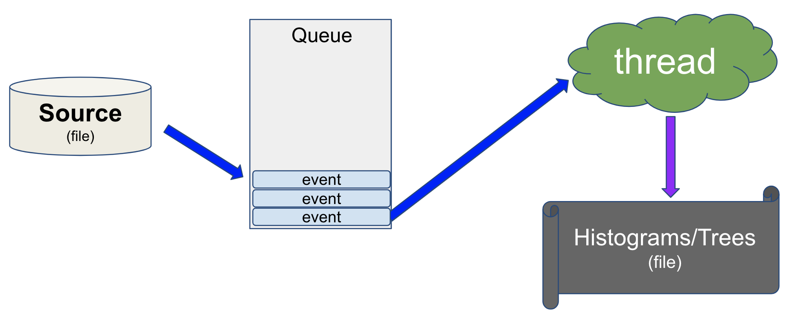
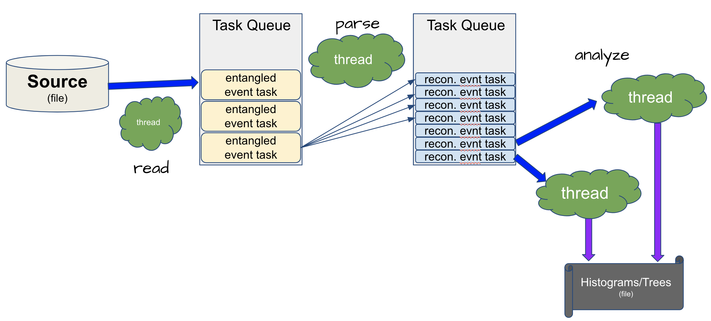

<center>
<table border="0" width="100%" align="center">
<TH width="20%"><A href="index.html">Welcome</A></TH>
<TH width="20%"><A href="Tutorial.html">Tutorial</A></TH>
<TH width="20%"><A href="Howto.html">How-to guides</A></TH>
<TH width="20%"><A href="Explanation.html">Principles</A></TH>
<TH width="20%"><A href="Reference.html">Reference</A></TH>
</table>
</center>

This tutorial will walk you through creating a standalone JANA plugin, introducing the key ideas along the way. 
The end result for this example is [available here](https://github.com/nathanwbrei/jana-plugin-example). 

### Introduction

Before we begin, we need to make sure that 
* The JANA library is installed
* The `JANA_HOME` environment variable points to the installation directory
* Your `$PATH` contains `$JANA_HOME/bin`. 

The installation process is described [here](Installation.html). We can quickly test that our install 
was successful by running a builtin benchmarking/scaling test:

```
jana -Pplugins=JTest -b
```

We can understand this command as follows:

* `jana` is the default command-line tool for launching JANA. If you would rather create your own executable which 
   uses JANA internally, you are free to do so.
   
* The `-P` flag specifies a configuration parameter, e.g. `-Pnthreads=4` tells JANA to use exactly 4 threads.
   
* `plugins` is the parameter specifying the names of plugins to load, as a comma-separated list (without spaces). 
By default JANA searches for these in `$JANA_HOME/plugins`, although you can also specify full paths.

* `-b` tells JANA to run everything in benchmark mode, i.e. it slowly increases the number of threads while 
measuring the overall throughput. You can cancel processing at any time by pressing Ctrl-C.


### Creating a JANA plugin

With JANA working, we can now create our own plugin. JANA provides a script which generates code skeletons 
to help us get started. If you are working with an existing project such as eJANA or GlueX, you 
should `cd` into `src/plugins` or similar. Otherwise, you can run these commands from your home directory.

We shall name our plugin "QuickTutorial". To generate the skeleton, run
```
jana-generate.py plugin QuickTutorial
```

This creates the following directory tree. 

```
QuickTutorial/
├── cmake
│   └── FindJANA.cmake
├── src
│   ├── CMakeLists.txt
│   ├── QuickTutorial.cc
│   ├── QuickTutorialProcessor.cc
│   └── QuickTutorialProcessor.h
└── tests
    ├── CMakeLists.txt
    ├── IntegrationTests.cc
    └── TestsMain.cc
```
#### Integrating into Existing Build
The skeleton contains a complete stand-alone CMake configuration and can be used as-is to
build the plugin. However, if you want to integrate the plugin into the source of a larger project
such as eJANA then you'll need to make some quick modifications:
* Tell the parent CMakeLists.txt to `add_subdirectory(QuickTutorial)`. 
* Delete `QuickTutorial/cmake` since the project will provide this
* Delete the superfluous project definition inside the root `CMakeLists.txt`

### Building the plugin
We build and run the plugin with the following:
```mkdir build
cd build
cmake ..
make install
jana -Pplugins=QuickTest
```

### Understanding the code
Let's dive into the skeleton code we've created. 
* `src/QuickTutorialProcessor.*` contains the skeleton of a `JEventProcessor`, which will eventually do
  the bulk of the heavy lifting. For now all it does is print the current event number to a log file.
* `src/QuickTutorial.cc` contains the plugin's entry point, whose only goal right now is to register the
  QuickTutorialProcessor with JANA.
* We have a parallel directory for tests set up so we can start writing tests immediately.


## Problem domain




## Parallelism concept

## Factories


## Event sources

## Event processors

## More complex topologies

### JEventSource

