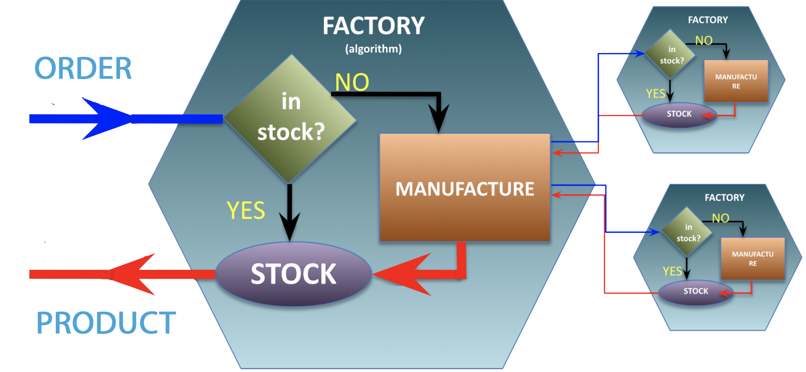

# JANA2 Concepts

## Core Architecture

This section provides higher-level background and context for JANA, and discusses JANA's design philosophy and the
associated tradeoffs.At its core, JANA2’s job is to take data in one form and apply some algorithms to it to produce
data in a more refined form. This process is organized into two main layers:

1. **Queue-Arrow Mechanism:** At the highest level, JANA2 uses [arrow model](https://en.wikipedia.org/wiki/Arrow_\(computer_science\)). In this model, data starts in a queue. An "arrow" is responsible for pulling data from the queue, processing it with algorithms, and then placing the processed data into another queue. The simplest setup consists of just two queues: one for input and one for output, with the arrow handling all the necessary algorithms to reconstruct the event. However, JANA2 can support much more complex configurations, where multiple queues and arrows are chained together. These arrows can operate sequentially or in parallel, depending on the needs of the processing task.

2. **Algorithm Management within Arrows:** Within each arrow, JANA2 organizes and manages the algorithms, along with their respective inputs and outputs. This internal structure allows for flexibility in how algorithms are applied to the data. Arrows can be configured differently to split the processing load across multiple types of algorithms.

By assigning threads to arrows, JANA2 takes full advantage of modern hardware, allowing it to process data concurrently across multiple cores and processors. This makes the framework both powerful and scalable, capable of handling complex data processing tasks efficiently.

## JANA concepts

- JObjects are data containers for specific resuts, e.g. clusters or tracks. They may be plain-old structs or they may
optionally inherit from (e.g.) ROOT or NumPy datatypes. 

- JEventSources take a file or messaging producer which provides raw event data, and exposes it to JANA as a stream.

- JFactories calculate a specific result on an event-by-event basis. Their inputs may come from an EventSource or may
be computed via other JFactories. All results are evaluated lazily and cached until the entire event is finished processing.
in order to do so. Importantly, JFactories are decoupled from one another via the JEvent interface. It should make no
difference to the JFactory where its input data came from, as long as it has the correct type and tag. While the [Factory 
Pattern](https://en.wikipedia.org/wiki/Factory_method_pattern) usually abstracts away the _subtype_ of the class being 
created, in our case it abstracts away the _number of instances_ created instead. For instance, a ClusterFactory may 
take m Hit objects and produce n Cluster objects, where m and n vary per event and won't be known until that
 event gets processed. 

- JEventProcessors run desired JFactories over the event stream and write the results to an output file or messaging
consumer. JFactories form a lazy directed acyclic graph, whereas JEventProcessors trigger their actual evaluation. 

## Object lifecycles

It is important to understand who owns each JObject and when it is destroyed.

By default, a JFactory owns all of the JObjects that it created during `Process()`. Once all event processors have 
finished processing a `JEvent`, all `JFactories` associated with that `JEvent` will clears and delete their `JObjects`. 
However, you can change this behavior by setting one of the factory flags:

* `PERSISTENT`: Objects are neither cleared nor deleted. This is usually used for calibrations and translation tables.
 Note that if an object is persistent, `JFactory::Process` will _not_ be re-run on the next `JEvent`. The user  
 may still update the objects manually, via `JFactory::BeginRun`, and must delete the objects manually via 
 `JFactory::EndRun` or `JFactory::Finish`. 
 
* `NOT_OBJECT_OWNER`: Objects are cleared from the `JFactory` but _not_ deleted. This is useful for "proxy" factories 
 (which reorganize objects that are owned by a different factory) and for `JEventGroups`. `JFactory::Process` _will_ be
 re-run for each `JEvent`. As long as the objects are owned by a different `JFactory`, the user doesn't have to do any 
 cleanup.
 
The lifetime of a `JFactory` spans the time that a `JEvent` is in-flight. No other guarantees are made: `JFactories` might
be re-used for multiple `JEvents` for the sake of efficiency, but the implementation is free to _not_ do so. In particular,
the user must never assume that one `JFactory` will see the entire `JEvent` stream.

The lifetime of a `JEventSource` spans the time that all of its emitted `JEvents` are in-flight. 

The lifetime of a `JEventProcessor` spans the time that any `JEventSources` are active.

The lifetime of a `JService` not only spans the time that any `JEventProcessors` are active, but also the lifetime of 
`JApplication` itself. Furthermore, because JServices use `shared_ptr`, they are allowed to live even longer than 
`JApplication`, which is helpful for things like writing test cases.

