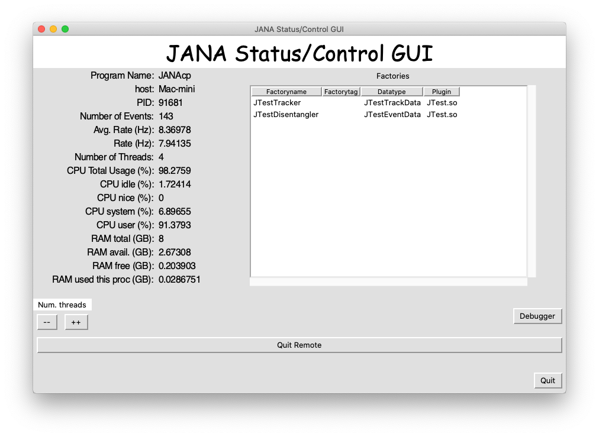

### JANA2 Status/Control Monitoring and Debugging GUI <!-- {docsify-ignore-all} -->



A very basic GUI program is included with JANA2 to help with monitoring and debugging JANA2 applications.
The JANA2 process that is to be monitored/debugged can be
running on either the local node or a remote node. For this to work, the following criteria must be met:

1. JANA must have been compiled with ZEROMQ support. (This relies
   on cmake find_package(ZEROMQ) successfully finding it when camke
   is run.)

2. The python3 environment must me present and have zmq installed.
   (e.g. pip3 install zmq)

3. The JANA process must have been started with the janacontrol plugin.
   This should generally be added to the *end* of the plugin list
   like this:
   
```
jana -Pplugins=JTest,janacontrol
```

To start the JANA control GUI, just run the `jana-control.py` program:

```
jana-control.py
```

By default, it will try to attach to port 11238 on the localhost. It
does not matter whether the JANA process is already running or not.
It will automatically connect when it starts and reconnect if the process
is restarted.

The following command line options are available for `jana-control.py`:

<pre>
-h, --help     Print this Usage statement and exit
--host HOST    Set the host of the JANA process to monitor
--port PORT    Set the port on the host to connect to
</pre>

n.b. To set the port used by the remote JANA process set the
jana:zmq_port configuration parameter when that process is started.
For example:

```
jana -Pplugins=JTest,janacontrol -Pjana:zmq_port=12345
```

Debugger
--------------

The `Debugger` GUI here is really just a browser. It does not allow 
for true control flow debugging. For that, please look at the command line
debugger features of JANA2. This is intended to give a way to step
through events and examine the exposed data members of the objects
created in the event.

To open the Debugger window, just press the button in the lower
right hand coner of the control window.


The GUI can be used to step through events in the JANA process and
view the objects, with some limitations. If the data object inherits
from JObject then it will display fields obtained from the subclass'
Summarize method. (See JObject::Summarize for details). If the data
object inherits from ROOT's TObject then an attempt is made to extract
the data members via the dictionary. Note that this relies on the
dictionary being available in the plugin and there are limitations
to the complexity of the objects that can be displayed.

When the debugger window is opened (by pushing the "Debugger" button
on the main GUI window), it will stall event processing so that single
events can be examined and stepped through. To stall processing on the
very first event, the JANA process should have the jana:debug_mode
config. parameter set to a non-zero value when it is started. e.g.

```
jana -Pplugins=JTest,janacontrol -Pjana:debug_mode=1
```

Once an event is loaded, click on a factory to display a list of 
objects it created for this event (displayed as the object's hexadecimal
address). Click on an object to display its content summary (if they
are accessible). n.b. clicking on a factory will NOT cause the factory
algorithm to activate and create objects for the event. It will only
display objects created by other plugins having activated the algorithm.
